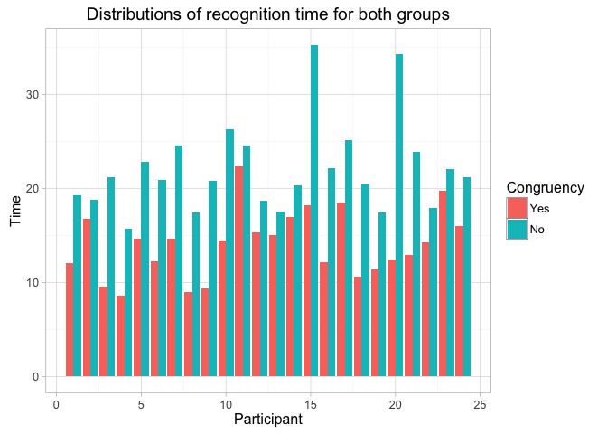

# Stroop_effect


### Load libraries and Stroop experimental data into R

```r
library(reshape2)
library(ggplot2)
se <- read.csv("~/Study/Data_Analyst/Projects/Project1/stroopdata.csv",sep=",")
str(se)
```

```
## 'data.frame':	24 obs. of  2 variables:
##  $ Congruent  : num  12.08 16.79 9.56 8.63 14.67 ...
##  $ Incongruent: num  19.3 18.7 21.2 15.7 22.8 ...
```

```r
summary(se)
```

```
##    Congruent      Incongruent   
##  Min.   : 8.63   Min.   :15.69  
##  1st Qu.:11.90   1st Qu.:18.72  
##  Median :14.36   Median :21.02  
##  Mean   :14.05   Mean   :22.02  
##  3rd Qu.:16.20   3rd Qu.:24.05  
##  Max.   :22.33   Max.   :35.26
```

```r
apply(se, 2, sd)
```

```
##   Congruent Incongruent 
##    3.559358    4.797057
```

### Convert data frame using melt, and plot the distribution of data using boxplot.


```r
mse <- melt(se,variable.name = "cong", value.name="time")
```

```
## No id variables; using all as measure variables
```

```r
mse$index <- rep(seq(1,24),2)
```

### Now make some plots:

```r
# boxplot
ggplot(data = mse) +
  geom_boxplot(aes(x=cong, y=time)) +
  xlab("Congruency") + ylab("time") +
  #coord_cartesian(ylim=c(10,30)) +
  ggtitle("Distributions of recognition time for both groups") +
  theme(plot.title = element_text(lineheight=.8, face="bold")) +
  theme_light()
```


```r
# barplot
ggplot(data = mse) +
  geom_bar(aes(x=index, y=time, fill=cong),stat = "identity",position="dodge") +
  xlab("Participant") + ylab("Time") +
  #coord_cartesian(ylim=c(10,30)) +
  ggtitle("Distributions of recognition time for both groups") +
  theme(plot.title = element_text(lineheight=.8, face="bold")) +
  theme_light() +
  scale_fill_discrete(name="Congruency",
                      breaks=c("Congruent","Incongruent"),
                      labels=c("Yes","No"))
```



```r
# lineplot
ggplot(data = se) +
  geom_line(aes(y=Congruent, x=seq(Congruent),
                color="Congruent",linetype="Congruent")) + 
  geom_line(aes(y=Incongruent, x = seq(Incongruent), 
                color="Incongruent", linetype="Incongruent")) +
  geom_line(aes(y = Incongruent - Congruent, x = seq(Incongruent), 
                color="Diff",linetype="Diff")) +
  scale_colour_manual(name="Line",
                      values=c(Congruent="red", Incongruent="blue",Diff="black")) +
  scale_linetype_manual(name="Line", 
                      values=c(Congruent="solid",Incongruent="solid",Diff="dashed")) +
  xlab("") + ylab("reaction time") + ggtitle("Line plot of reaction time")
```


```r
ggplot(data = se, aes(Congruent, Incongruent)) + geom_point() + geom_smooth()
```


### Paired t-test on the data.


```r
t_test <- t.test(x = se$Congruent, y=se$Incongruent,
       paired = TRUE,conf.level = 0.95)
str(t_test)
```

```
## List of 9
##  $ statistic  : Named num -8.02
##   ..- attr(*, "names")= chr "t"
##  $ parameter  : Named num 23
##   ..- attr(*, "names")= chr "df"
##  $ p.value    : num 4.1e-08
##  $ conf.int   : atomic [1:2] -10.02 -5.91
##   ..- attr(*, "conf.level")= num 0.95
##  $ estimate   : Named num -7.96
##   ..- attr(*, "names")= chr "mean of the differences"
##  $ null.value : Named num 0
##   ..- attr(*, "names")= chr "difference in means"
##  $ alternative: chr "two.sided"
##  $ method     : chr "Paired t-test"
##  $ data.name  : chr "se$Congruent and se$Incongruent"
##  - attr(*, "class")= chr "htest"
```

```r
t_test
```

```
## 
## 	Paired t-test
## 
## data:  se$Congruent and se$Incongruent
## t = -8.0207, df = 23, p-value = 4.103e-08
## alternative hypothesis: true difference in means is not equal to 0
## 95 percent confidence interval:
##  -10.019028  -5.910555
## sample estimates:
## mean of the differences 
##               -7.964792
```
